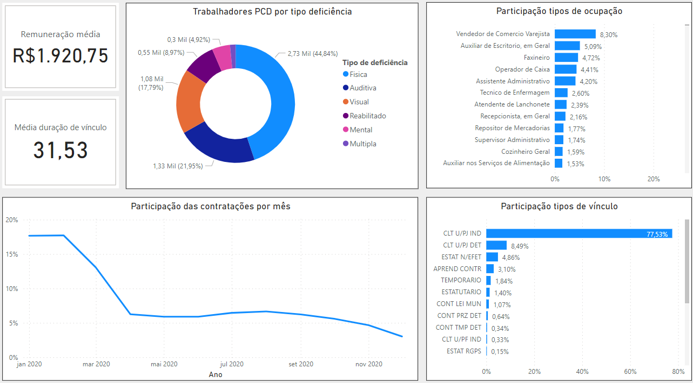
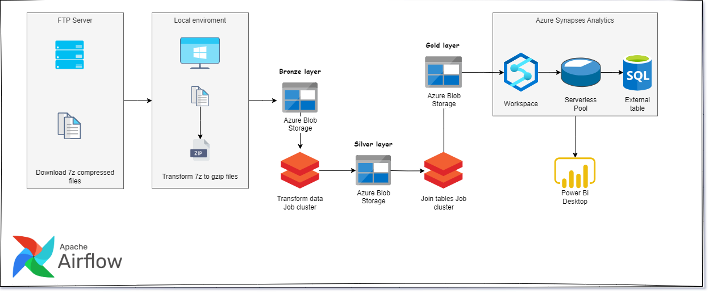

## Overview

The goal of this project is to perform a data engineer ETL pipeline for creating a Data Warehouse on the Brazilian job market dataset named RAIS, using technologies such as Airflow, Pyspark with Azure Databricks, Azure Synapses Analytics, and Power BI. 
### Data Visualization

### Data Architecture

- The original dataset was a 6-part 7z file format, separated by Brazilian main regions (North, South, East, West, North East, and Midwest).
- Extract and compress the dataset file to a gzip format locally with Airflow, so we have a light file size to upload to blob storage and a compatible file format to spark to read.
- Load data in Azure blob storage or Azure Data Lake so we can easily interact with Databricks and Azure Synapses Analytics.
- The unified dataset has more than 65 million records so we need powerful data processing like spark.
- Transforming data with Pyspark through 3 tiers (Bronze, Silver, Gold)
- Azure Synapses Analytics provides an easy-to-set external table from Azure Data Lake Storage Gen 2 acting like a Data Warehousing.
- Azure Synapses Analytics also provides an interface with Microsoft Power BI, through a linked service configuration, however, due to my Microsoft account not being of a Professional type I have to plug it into the Microsoft BI desktop. 

### Dataset
The RAIS job market dataset records include fields capturing the month of admission, salary, age, hours worked within a month, sex, color race, type of occupation, city, state, industry sector and subsector, duration of actual labor, and much more.

Here we have information about the dataset used in this project and how to download it- https://www.gov.br/trabalho-e-emprego/pt-br/assuntos/estatisticas-trabalho/microdados-rais-e-caged

## Contact

Please feel free to contact me if you have any questions at: LinkedIn, Twitter
