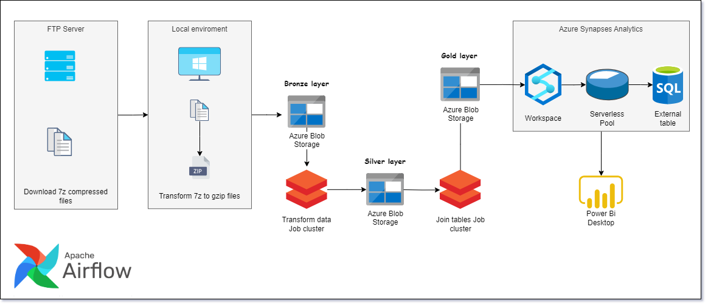

## Overview

The goal of this project is to perform a data engineer ETL pipeline for creating a Data Warehouse on the Brazilian job market dataset named RAIS, using technologies such as Airflow, Pyspark with Azure Databricks, Azure Synapses Analytics, and Power BI. 
### Data Visualization

### Data Architecture

#### High-level architecture

#### Airflow's Orchestration architecture 

If you decide to include this, you should also talk a bit about why you chose the architecture and tools you did for this project.

## Prerequisites

Directions or anything needed before running the project.

- Prerequisite 1
- Prerequisite 2
- Prerequisite 3

## How to Run This Project

Replace the example step-by-step instructions with your own.

1. Install x packages
2. Run command: `python x`
3. Make sure it's running properly by checking z
4. To clean up at the end, run script: `python cleanup.py`

## Lessons Learned

It's good to reflect on what you learned throughout the process of building this project. Here you might discuss what you would have done differently if you had more time/money/data. Did you end up choosing the right tools or would you try something else next time?

## Contact

Please feel free to contact me if you have any questions at: LinkedIn, Twitter
